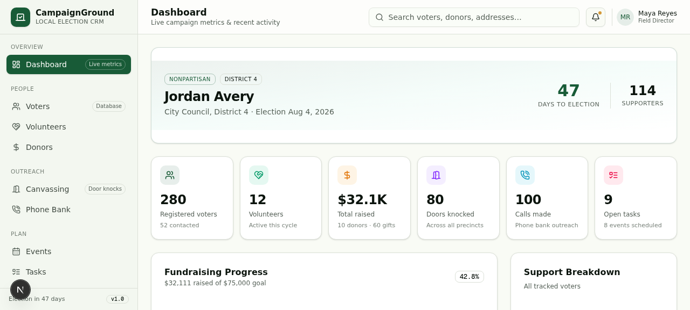
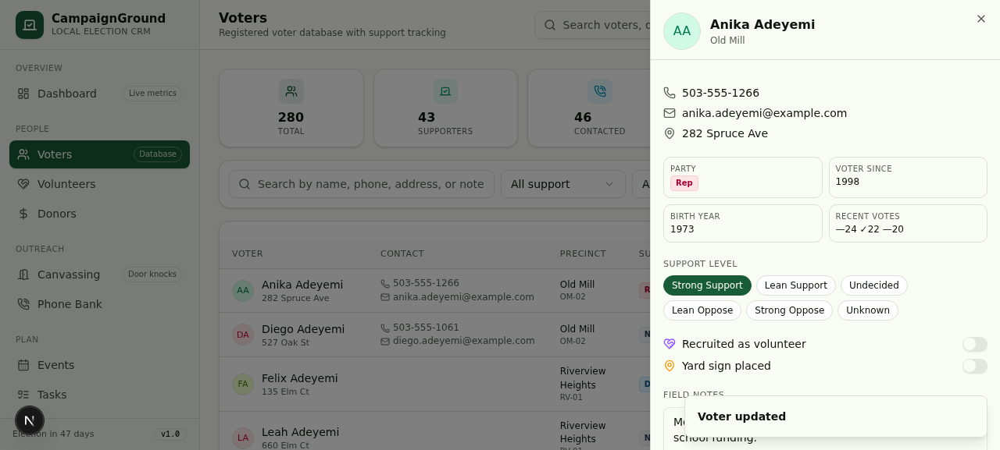
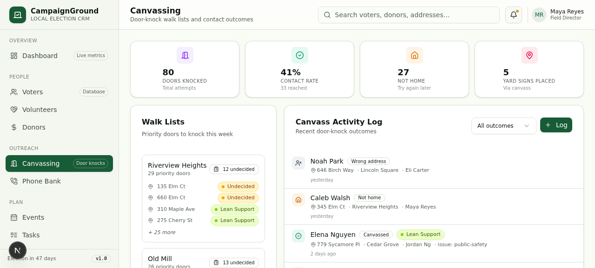
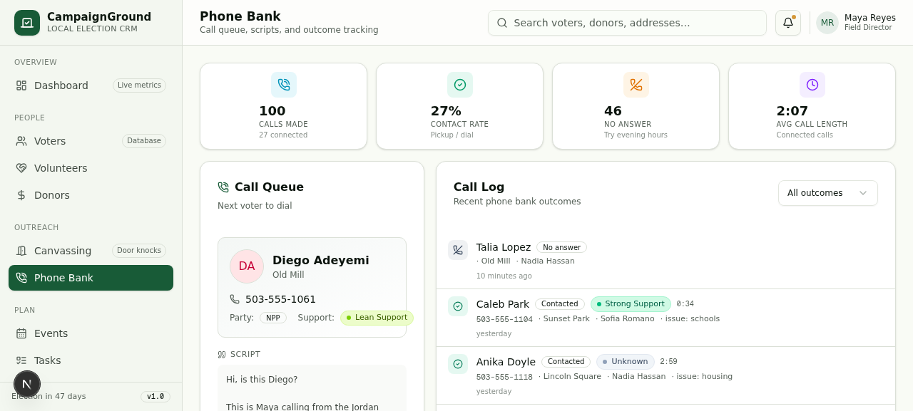
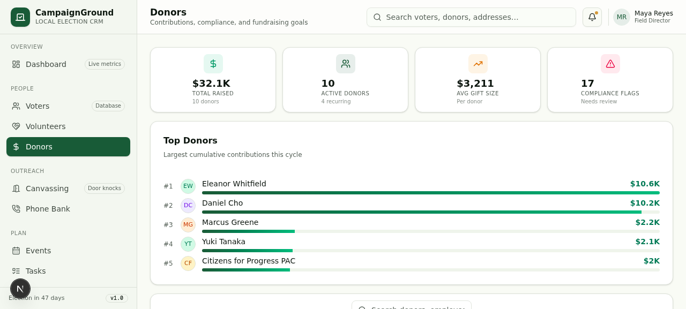
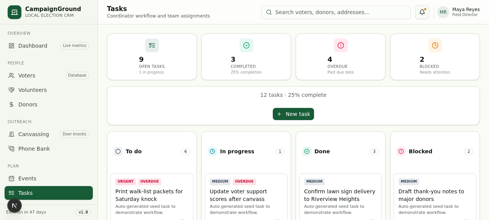

# CampaignGround

[](https://github.com/tigwyk/open-candidate-crm/actions/workflows/ci.yml)
[](LICENSE)

A voter, volunteer, donor, and outreach CRM built specifically for campaigns running for local office — city council, school board, mayor. Multi-campaign, multi-user, and free of the bloat of a generic sales CRM.

## Screenshots

| Dashboard | Voters | Canvassing |
|---|---|---|
|  |  |  |

| Phone Bank | Donors | Tasks |
|---|---|---|
|  |  |  |

More in [`docs/screenshots/`](docs/screenshots/), including mobile views.

## Features

- **8 core modules** — Dashboard, Voters, Volunteers, Donors, Canvassing, Phone Banking, Events, Tasks
- **Multi-campaign, multi-user** — one deployment can host several campaigns, each with its own `owner`/`member` roles
- **Duplicate-contact prevention** — a claim/lock system stops two volunteers from knocking the same door or calling the same voter at once
- **Self-service signup** — anyone can create an account and a fresh campaign at `/signup`
- **Team invites** — campaign owners invite teammates by email (Postmark), with bounce detection and automatic re-activation on resend
- **Production-hardened API** — every mutating route is zod-validated and rate-limited, not just auth-gated

## Tech stack

| Layer | Choice |
|---|---|
| Framework | Next.js 16 (App Router), React 19, TypeScript (strict) |
| Auth | next-auth v4 (Credentials provider, JWT sessions) |
| Database | PostgreSQL via Prisma |
| Styling | Tailwind CSS 4 + shadcn/ui + Radix primitives |
| Data fetching | TanStack React Query |
| Email | Postmark (transactional + bounce webhooks) |
| Package manager | [Bun](https://bun.sh) |
| Deployment | Docker, deployed on [Railway](https://railway.app) |

See [`docs/ARCHITECTURE.md`](docs/ARCHITECTURE.md) for the full domain model, auth model, and module map.

## Quickstart

Prerequisites: [Bun](https://bun.sh), [Docker](https://docker.com) (for local Postgres).

```bash
git clone https://github.com/tigwyk/open-candidate-crm.git
cd open-candidate-crm
cp .env.example .env

docker compose up -d          # starts local Postgres, matches .env.example out of the box
bun install
bunx prisma migrate deploy    # applies all migrations

bun run dev                   # http://localhost:3000
```

From there, either:
- Visit `/signup` to create your own account and a blank campaign, or
- Hit `GET /api/seed` once to bootstrap a demo admin account and a fully-populated demo campaign (280 voters, volunteers, donors, events — good for exploring the UI without data entry).

## Environment variables

Full reference lives in [`.env.example`](.env.example). Grouped by concern:

- **Database** — `DATABASE_URL` (Postgres connection string)
- **Auth** — `NEXTAUTH_SECRET`, `NEXTAUTH_URL`, plus a legacy `ADMIN_EMAIL`/`ADMIN_PASSWORD_HASH` fallback only consulted during the very first `GET /api/seed` bootstrap
- **Signup** — `MAX_USERS` (optional cap on total accounts; unset = unlimited)
- **Email (Postmark)** — `POSTMARK_SERVER_TOKEN`, `EMAIL_FROM`, `POSTMARK_WEBHOOK_USERNAME`/`POSTMARK_WEBHOOK_PASSWORD` (Basic Auth for the bounce webhook). Without `POSTMARK_SERVER_TOKEN` set, invite emails are logged to the console instead of sent — handy for local dev.

## Deployment

Ships as a standalone Docker image (`Dockerfile`) that runs `prisma migrate deploy` before starting the server, so schema migrations apply automatically on every deploy. `railway.json` pins the service to a single replica — the in-memory rate limiter only works correctly on one instance.

On [Railway](https://railway.app): provision a Postgres plugin, link its `DATABASE_URL` as a reference variable, set the auth/email env vars above, and deploy from this repo.

## Contributing

See [`CONTRIBUTING.md`](CONTRIBUTING.md).

## License

[MIT](LICENSE)
